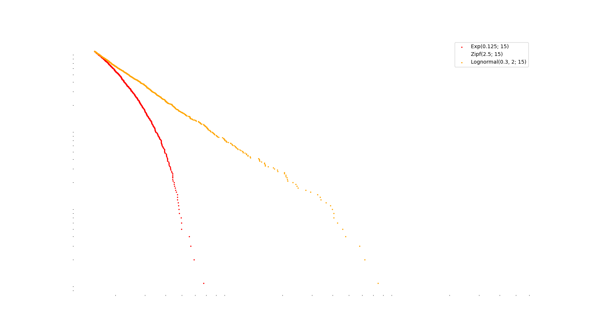
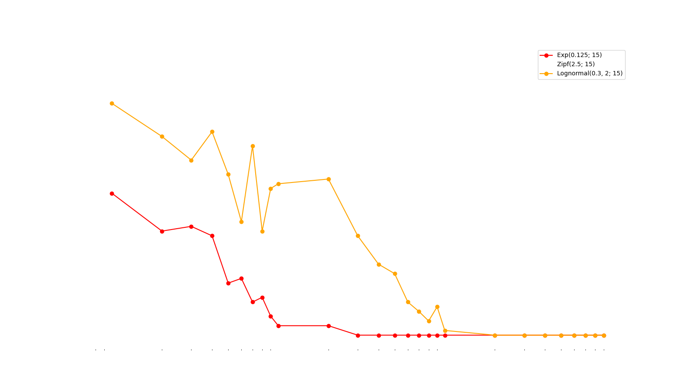
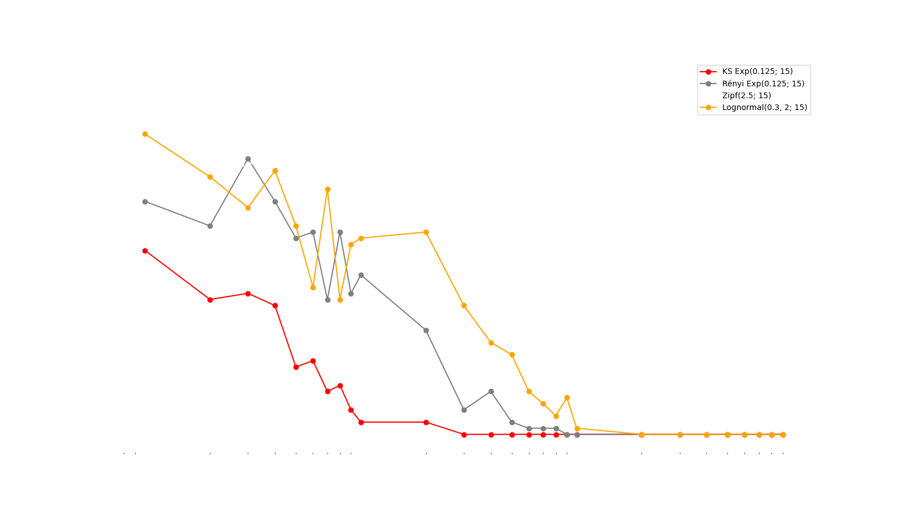
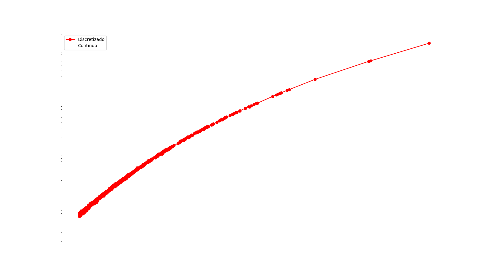
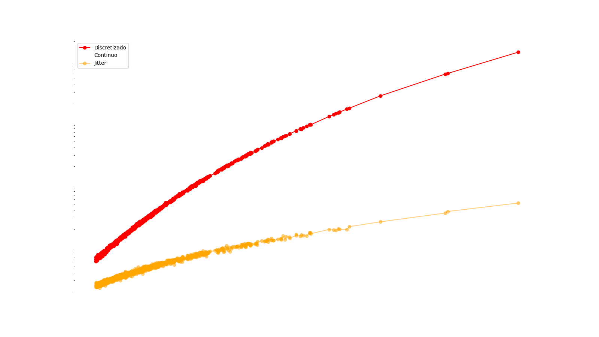
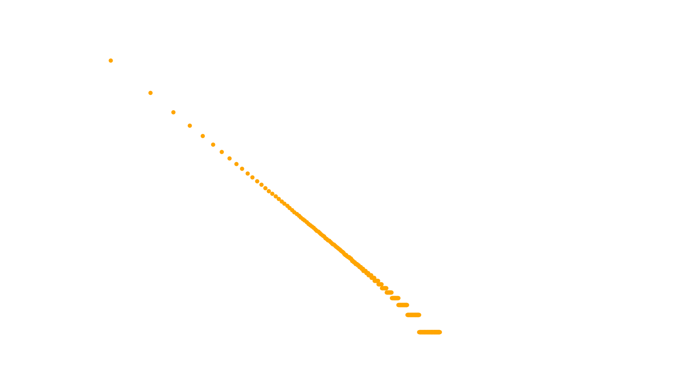

## Agenda

- Recomendação de Leitura
- Ideias principais de _Power Laws_
- Teste de Hipóteses
- _Jittering_
- FAERS

# A inspiração

## {transition="fade"}

\newcommand{\ket}[1]{|#1\rangle}
\newcommand{\bra}[1]{\langle#1|}
\newcommand{\braket}[2]{\langle#1|#2\rangle}

<h3>Revisão e Extensão</h3>
<h4>@Clauset_2009</h4>
<h4>_Power-law distributions in empirical data_</h4>

$$\\[5pt]$$
 

::: {.fragment .fade-in-then-out}

- Boas práticas
- Exemplos sintéticos
- 24 Exemplos em conjuntos de dados reais

:::

# _Power Law_ ou _Zipf-Mandelbrot Law_

## {transition="fade"}

<h3>_Power Law_ ou _Zipf's Law_</h3>

::: {.fragment .fade-in}

$$y \propto \frac{1}{x},~ x \in \{1,2,3,...\}$$

:::

::: {.fragment .fade-in}

$$\text{frequência}_{k} \propto \frac{1}{k}$$
$$\text{frequência}_{1} = C\frac{1}{1}$$

:::

::: {.fragment .fade-in}

$$\text{frequência}_{n} = \frac{C}{n} = \frac{\text{frequência}_{1}}{n}$$

:::

## {transition="fade"}

<h3>_Power Law_ ou _Zipf-Mandelbrot Law_</h3>

$$y \propto \frac{1}{(x + x_\min)^{\alpha}}$$

## {transition="fade"}

## {transition="fade"}

## {transition="fade"}

# Erro discreto e Contínuo

## {transition="fade"}

## {transition="fade"}

# Aplicação FAERS

## {transition="fade"}

## {transition="fade"}

## {transition="fade"}

$$\hat{\alpha} \approx 1.92 \qquad \text{p-valor}(n = 1000) = 0.04$$

##

### Principais Referências

::: {#refs}

:::

# Obrigado pela atenção